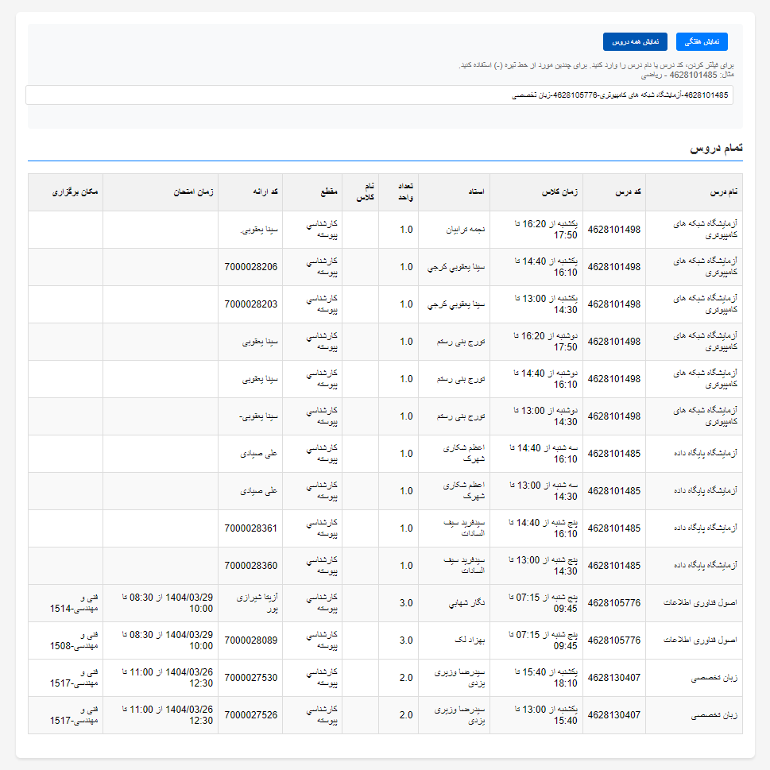
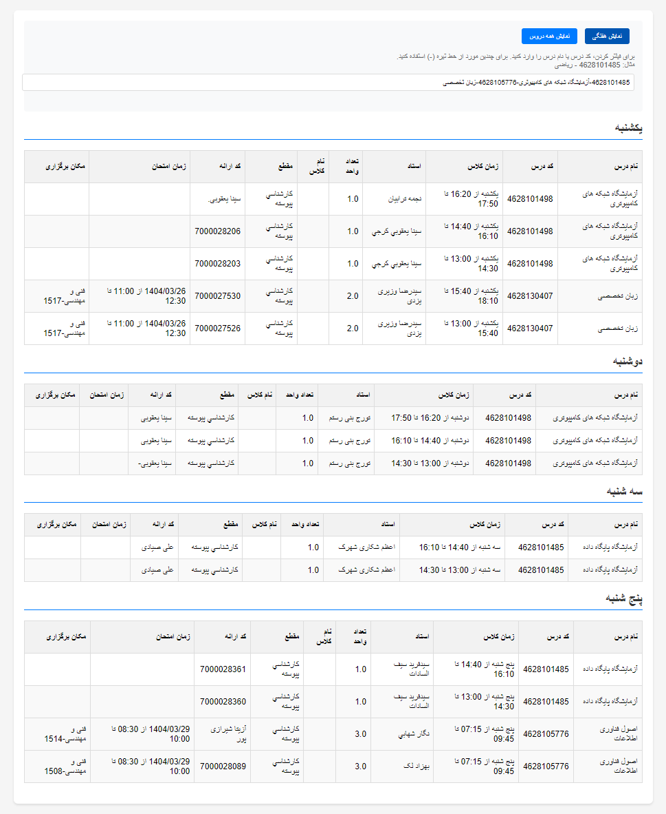

# AmozeshyarTimetable

## Prerequisites

- Python 3.x
- BeautifulSoup 4

To install BeautifulSoup, you need pip. If you don't have pip installed, you can install it using:
```sh
python -m ensurepip --upgrade
```

Once pip is installed, you can install BeautifulSoup using:
```sh
pip install beautifulsoup4
```

---

## Usage

To use this script, follow these steps:

1. **Clone this repository**:
```sh
git clone https://github.com/abolfazlvahed1/AmozeshyarTimetable.git
```
2. **Download HTML Files**: 
   If you are part of the computer group of Tehran Markaz, all offered courses have already been downloaded for you, so you can skip this step.

   For others, visit https://eserv.iau.ir/EServices/pSearchAction.do, search for your group's offered courses, and download all HTML files. If there are multiple pages, ensure you download all of them.
  
   Alternatively, if you prefer to automate the process of downloading all the necessary HTML files, I've created another project that crawls Amozeshyar and fetches all HTML files for you. You can find the repository for that project [here](https://github.com/abolfazlvahed1/AmozeshyarCourseScraper). This tool will automatically retrieve all HTML pages you need for this script.

3. **Specify HTML Folder Path**: 
   Place all the downloaded HTML files in a folder (e.g., `html-pages/`). You do not need to specify individual file paths. The script will automatically process all `.html` files in the folder.


4. **Run the Script**: 
   Execute the script by running the following command:
    ```sh
    python /path/to/script.py
    ```

   This will generate a html with file named `schedule_output.html` in the current directory, containing a html that can see all course.

Example of `schedule_output.html`:
- course view:

- weekly view:


## Notes

- This script processes all `.html` files in the specified folder. Ensure all the course HTML files are placed within that folder.
- If the structure of the HTML files in Amozeshyar changes, or if there are issues with the HTML files, the script may not work as expected.